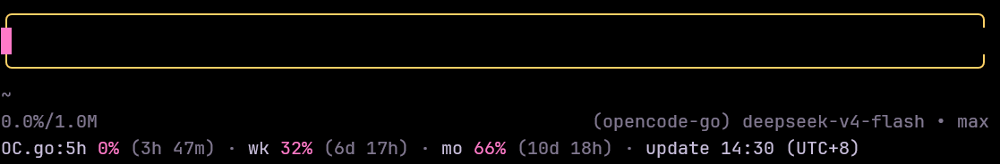

# pi-ocgo-usage

[](https://www.npmjs.com/package/pi-ocgo-usage)
[](./LICENSE)



A [Pi coding agent](https://pi.dev/) extension that displays [OpenCode Go](https://opencode.ai/docs/go/) subscription usage in the footer when using an `opencode-go/*` model.

> **⚠️ This extension requires an OpenCode Go session cookie to function.**
> The cookie is a **full user session** (not an API key) and grants access to your entire OpenCode account.
> Treat it with the same care as your password. See [Configuration](#configuration) below for how to obtain and store it.

## Why

**OpenCode Go is a prepaid subscription** — rolling (5h), weekly, and monthly windows, each with its own quota. When a window is exhausted you get rate-limited mid-work, which is exactly the worst moment to discover it. Yet there is **no official usage API yet**: the only place to see your numbers is the opencode.ai dashboard, and you have to open a browser to check.

This extension puts the numbers where you already are — the Pi footer:

- **Always visible** while you work with an `opencode-go/*` model, no browser tab needed
- **Warns before you hit the wall**: color shifts to `warning` at ≥80% and `error` at ≥90% or when rate-limited
- **Shows data freshness**: `update 14:32 (UTC+8)` tells you when the numbers were last fetched, so a stale footer never misleads you
- **Pre-wired for the official API** ([PR #16513](https://github.com/anomalyco/opencode/pull/16513)): the moment opencode ships it, this extension switches to it automatically and the current cookie/SSR approach becomes the fallback

## Features

- **Auto Footer Display** — Automatically shows usage in the footer when using any `opencode-go/*` model
- **Three Windows** — Rolling (5h), weekly, and monthly usage percentages with reset countdowns
- **Color Thresholds** — `muted` / `warning` (≥80%) / `error` (≥90% or rate-limited)
- **Refresh Cooldown** — Fetches at most once per 5 minutes per session (constant `cooldownMs`; the `cacheTTL` config field is reserved for the future API path)
- **Graceful Degradation** — On HTTP error, footer shows `<err:code>`; on missing config, footer is silently empty
- **Future-proof** — Pre-wired for the official API ([PR #16513](https://github.com/anomalyco/opencode/pull/16513)): the moment it ships, the extension switches to it automatically and the current cookie/SSR approach becomes the fallback

## Install

### From GitHub (recommended for testing)

```bash
pi install https://github.com/v587d/pi-ocgo-usage.git
```

This clones the repo (which ships a pre-built `dist/`) and registers the extension in your `~/.pi/agent/settings.json`.

### From npm (after first release)

```bash
pi install npm:pi-ocgo-usage
```

### From a local checkout (development)

```bash
git clone https://github.com/v587d/pi-ocgo-usage.git
cd pi-ocgo-usage
bun install
bun run build
pi install ./
```

> Note: `pi install` uses `--ignore-scripts`, so `prepare` and `postinstall` hooks won't run. The repo ships a pre-built `dist/` for GitHub installs; for local development, run `bun run build` after install.

## Configuration

### Required: provide your OpenCode Go session cookie + workspace ID

1. **Open `https://opencode.ai/workspace/<your-workspace-id>/go` in a browser**
   (sign in if prompted). The URL is your workspace ID — copy the part starting with `wrk_`.

2. **Open DevTools → Application → Cookies → `https://opencode.ai`**
   Copy the **full value** of the `auth` cookie. It looks like `Fe26.2*<base64>*<sig>*<exp>*<hmac>`.

3. **Set environment variables** (preferred for personal use):

   ```bash
   export OPENCODE_GO_COOKIE="auth=Fe26.2*...; oc_locale=zh"
   export OPENCODE_GO_WORKSPACE_ID="wrk_01XXXXXXXXXXXXXXXXXXXXXXXX"
   ```

   Or write to `~/.pi/agent/pi-ocgo-usage.json`:

   ```jsonc
   {
     "cookie": "auth=Fe26.2*...; oc_locale=zh",
     "workspaceID": "wrk_01XXXXXXXXXXXXXXXXXXXXXXXX"
   }
   ```

   ```bash
   chmod 600 ~/.pi/agent/pi-ocgo-usage.json
   ```

### Optional overrides

| Env var | Default | Description |
|---|---|---|
| `OPENCODE_GO_BASE_URL` | `https://opencode.ai` | API base URL |
| `OPENCODE_GO_CACHE_TTL` | `300` | Cache seconds, 60–3600 |
| `OPENCODE_GO_MODE` | `auto` | `auto` / `cookie` / `apikey` |
| `OPENCODE_GO_TIMEOUT_MS` | `10000` | HTTP timeout |

> ⚠️ **Cookie expiration:** the `auth` cookie is signed by Cloudflare Iron Session and is valid for **1 year** from issue. When it expires (or is revoked), the `/workspace/<wrk>/go` page 302-redirects to the login page, which parses as an empty page — the footer then shows no windows rather than an error. Re-login to opencode.ai and update the cookie via `/oc-go-config set`.

## Slash commands

The extension registers the `/oc-go-config` command — run it inside a Pi chat to configure or test the extension without touching your shell:

| Command | What it does |
|---|---|
| `/oc-go-config` (no args) | Show current config summary + usage help |
| `/oc-go-config status` | Same as no args (explicit) |
| `/oc-go-config set` | Interactive wizard: paste `workspace_id` + cookie → **persists to `~/.pi/agent/pi-ocgo-usage.json` (mode 0600)** after confirmation. Pasting works with any of: full header (`auth=…; oc_locale=zh`), just the auth value (`Fe26.2*…`), or value + locale — it is normalized automatically |
| `/oc-go-config test` | One-shot live fetch with current config; renders exactly what the footer would show (use this to verify cookie/workspace) |
| `/oc-go-config clear` | Delete the persisted config file (cookie + workspace ID) |

## Usage

When using any `opencode-go/*` model, the footer shows:

```
OC.go: 5h 23% (3h 25m) · wk 30% (4d 6h) · mo 12% (12d 4h)
```

- Each window: `<label> <percent>% (<time remaining>)`
- Color: muted → warning (≥80%) → error (≥90% or rate-limited)
- On successful fetch: appended as `· update 14:32 (UTC+8)` — local time of the last successful refresh, so you can see how stale the data is
- If any window is missing (e.g., new account): that segment is omitted

Footer is **cleared** when switching to a non-OpenCode-Go model or on session shutdown.

## How It Works

The extension reverse-engineered the opencode.ai console and found that the `/_server` RPC endpoint (which the dashboard uses for its own API-key calls) **always rejects cookie-authenticated requests with HTTP 500** — so it is not usable. Instead, the extension scrapes the SSR-rendered usage page:

```
GET /workspace/<wrk>/go
Cookie: auth=Fe26.2*...; oc_locale=zh
```

The page renders each usage window as a `data-slot="usage-item"` block; the extension parses the percent and the human-readable reset phrase (e.g. `Resets in 2 hours 29 minutes`) and normalizes them into the internal `NormalizedUsage` shape:

```jsonc
{
  "useBalance": true,
  "updatedAt": 1786335000000,
  "rolling": { "percent": 80, "resetInSec": 3840,  "status": "ok" },
  "weekly":  { "percent": 32, "resetInSec": 586800,"status": "ok" },
  "monthly": { "percent": 66, "resetInSec": 939600,"status": "ok" }
}
```

`updatedAt` (epoch ms) is stamped by `fetchUsage` on every successful fetch and rendered as the footer's `· update HH:MM (UTC+8)` freshness indicator (local timezone). `useBalance` (whether over-limit usage falls back to your Zen balance) is still parsed but no longer rendered.

### Official API auto-switch ([anomalyco/opencode#16513](https://github.com/anomalyco/opencode/pull/16513))

The official `GET /zen/go/v1/usage` endpoint (Bearer auth via `ctx.modelRegistry.getApiKeyForProvider("opencode-go")`) is **pre-wired and auto-enabled when the PR ships** — `buildPathList()` already contains the switch logic (apikey path first, cookie/SSR as fallback). Until the PR merges, the apikey endpoint always 404s, so the cookie path is used. No client-side changes are required on your end; watch the PR (or the [tracking workflow](#tracking-the-official-api-pr)) for the switch.

### Tracking the official API PR

Two ways to stay informed — use both:

1. **GitHub notification (instant, manual):** sign in to GitHub, open [anomalyco/opencode#16513](https://github.com/anomalyco/opencode/pull/16513) and click **Subscribe** (🔔, right sidebar). You get an email on every event, including the merge.
2. **Repo auto-tracker (zero effort):** this repository ships a scheduled workflow (`.github/workflows/pr-tracker.yml`) that polls the PR every 6 hours and:
   - commits a status snapshot to `docs/pr-16513-status.md` (state, merge commit, last checked),
   - **opens an issue in this repo the moment the PR merges** — if you watch this repo (or get notifications for your own repos), that's your automated ping to update/release the extension with the apikey path enabled.

See [docs/RESEARCH.md](./docs/RESEARCH.md) for full reverse-engineering details and [docs/SPEC.md](./docs/SPEC.md) for the implementation contract.

## Troubleshooting

| Symptom | Meaning / fix |
|---|---|
| Footer empty, no windows | Cookie invalid/expired → 302 to login page (parses as empty). Re-login & `/oc-go-config set` |
| `<err:http500>` | Server-side error on `/workspace/<wrk>/go` (transient backend issue). Retry later; run `/oc-go-config test` for the raw message |
| `<err:noconfig>` | Missing cookie + workspace ID. Run `/oc-go-config set` or set the env vars above |
| `<err:timeout>` | Backend slow; raise `OPENCODE_GO_TIMEOUT_MS` |

## Security

- **The `auth` cookie is a full OpenCode user session.** Anyone with it can access every workspace, subscription, and billing detail in your account. Treat it like a password:
  - Never share it in chat / issues / screenshots
  - Never commit `~/.pi/agent/pi-ocgo-usage.json` to git
  - The extension sets `chmod 600` on the config file automatically
  - If you accidentally leak the cookie, sign out of opencode.ai immediately (this invalidates it)

- The extension **never**:
  - Logs the cookie value
  - Persists it to session entries
  - Emits it via `pi.events`
  - Includes it in error messages shown to the user

## Development

```bash
bun install
bun run dev        # watch mode
bun run test       # run unit tests
bun run check      # typecheck + lint
bun run build      # tsc → dist/
```

## License

MIT — see [LICENSE](./LICENSE).
